# Architecture

How the project fits together: what each area of the repo does, how data
moves between areas, and what kinds of files belong in each folder. For setup
and workflow, see [README.md](README.md) and [CONTRIBUTING.md](CONTRIBUTING.md).

## Overview

The dashboard is a **static site with no server**. All the heavy work
(scraping, cleaning, joining, scoring) happens ahead of time in Python. Python
writes plain JSON files, and the browser loads those files directly with D3.

The **GitHub repo is the hub**: every other part connects to it. Node colors
show the tech used (sources, GitHub, Python, D3.js), and the dashed edge is the
optional scheduled pipeline run.

Even though everything meets in the repo, data only moves **one way**:
sources → `data/raw/` → `backend/` → `frontend/data/` → browser. Each area
reads only from the step before it and writes only to the step after it.
That keeps the areas independent: someone can work on a scraper without
touching the frontend, and the reverse.

## Tech stack

| Area | Stack |
|---|---|
| Scrapers | Python 3.12, HTTP requests, HTML/JSON parsing |
| Backend | Python 3.12, tabular and geospatial processing (pandas / GeoPandas style tooling) |
| Frontend | Plain HTML, CSS, and D3.js v7 as ES modules. No build step, no framework. |
| Automation | GitHub Actions (scheduled scraping, pipeline runs, CI, Pages deploy) |
| Hosting | GitHub Pages, serving `frontend/` |

Python packages go in `requirements.txt` as they're adopted.

## Areas

### 1. Scrapers: `scrapers/`

**Job:** fetch data from outside sources and save it as-is.

- One subfolder per source: `veo_gbfs/`, `upd_crime_alerts/`, `clery_log/`,
  `gis_layers/`, `news/`.
- Each scraper writes **only** to its matching folder in `data/raw/`.
- Scrapers don't clean, merge, or interpret anything. They save what the
  source returned (or a minimal parse of it) with a timestamp, so the backend
  can always be rerun from the original data.
- Code shared by all scrapers (paths, HTTP session, saving helpers) lives in a
  single module at the top of `scrapers/`.

| Source | What it gives us | How often |
|---|---|---|
| Veo GBFS | Snapshots of available vehicles (location, type, battery) | Every few minutes while collecting |
| UPD Crime Alerts | E-bike and e-scooter theft alerts | Weekly |
| Clery crime log | All reported bike/scooter incidents; public log only keeps ~60 days | At least weekly, so nothing ages out |
| GIS layers | Bike lanes, bike racks, buildings, campus boundary | Rarely; only when the source changes |
| News | Article metadata and quoted statistics (no article text) | By hand, as articles appear |

**Files here:** Python scripts (`.py`), one entry script per source, plus
small helper modules and scraper tests.

### 2. Data: `data/`

**Job:** hold every input the backend reads.

| Folder | Contents | Committed? |
|---|---|---|
| `data/raw/<source>/` | Scraper output, unmodified. Treat as append-only: add new files, don't edit old ones. | Yes (except very large raw data; see Open decisions) |
| `data/reference/` | Hand-made inputs that no scraper can produce: dismount zones drawn by hand, the news metadata file, academic calendar, sunset times, zone name corrections. | Yes |
| `data/interim/` | Intermediate pipeline output (cleaned tables, inferred trips). Regenerated on every run. | No (gitignored) |

**Files here:** `.json`, `.geojson`, and `.csv`. No code.

### 3. Backend: `backend/`

**Job:** turn raw data into the small, ready-to-draw JSON files the dashboard
needs. This is the only place analysis happens.

The pipeline runs in four stages, one subfolder each:

| Stage | Folder | What it does |
|---|---|---|
| Geography | `backend/geo/` | Builds the **shared ~150 m grid** and the named campus zones, and matches free-text locations ("outside Zachary") to a zone. |
| Processing | `backend/processing/` | Cleans and merges incidents, infers trips and parking from Veo snapshots, and joins everything to grid cells and zones. |
| Analysis | `backend/analysis/` | Computes metrics per cell and zone (demand by hour, night share, rack load, theft counts) and any composite scores. |
| Export | `backend/export/` | Writes the final JSON files into `frontend/data/`. |

The backend also has a settings module (paths, grid size, campus bounds) and a
single entry point that runs all four stages in order.

**The shared grid is the backbone.** Every dataset gets aggregated to the same
grid cells and zones, so any two parts of the dashboard can be linked (click
a cell in one view, highlight it in another) and compared.

**Files here:** Python modules (`.py`) and tests.

### 4. The data contract: `frontend/data/`

`frontend/data/` is the **only** point of contact between backend and
frontend.

- The backend writes these files. Frontend code never edits them.
- The frontend reads only from this folder. It never reads `data/raw/` or
  anything else.
- Keep the files small and pre-aggregated. The browser should draw them, not
  compute over them.
- Changing a file's structure (renaming a field, changing a type, splitting a
  file) is a **breaking change**. Tick the box in the PR template and tell
  whoever works on the views that read it.

**Files here:** `.json` and `.geojson`, generated by the backend.

### 5. Frontend: `frontend/`

**Job:** draw the dashboard in the browser with D3.

| Path | Contents |
|---|---|
| `index.html` | Page layout: header and a container for each dashboard section. |
| `css/` | Stylesheets: color and spacing tokens, layout, component styles. |
| `js/` (top level) | Entry point that sets up the page, and a data loader that fetches and caches the JSON from `data/`. |
| `js/components/` | Reusable pieces shared by several views: base campus map and projection, tooltip, legends, time scrubber, and similar. |
| `js/sections/` | One module per dashboard section. Each section loads its own data and draws into its own container. |
| `assets/` | Static images and icons. |

Conventions:

- D3 is loaded as an ES module from a CDN, so there's nothing to install or
  build. Any static server can run the site.
- Sections don't talk to each other directly. When views need to be linked
  (shared selection, time filter), that shared state goes through one small
  module in `js/` that every section can subscribe to.
- Anything two sections both need becomes a component instead of being copied.

**Files here:** `.html`, `.css`, `.js` (ES modules), images.

### 6. Automation: `.github/`

| Path | Contents |
|---|---|
| `workflows/ci.yml` | Runs on every PR: Python error checks, JSON validation, tests. |
| `workflows/` (planned) | Scheduled workflows that run the scrapers and the pipeline and commit the results, plus a workflow that deploys `frontend/` to GitHub Pages. |
| `ISSUE_TEMPLATE/`, `pull_request_template.md` | Templates for issues and PRs. |
| `dependabot.yml` | Monthly dependency updates. |

### 7. Docs: `docs/`

Course deliverables, not code docs: the proposal, prototype, and final reports
(`docs/proposal/`, and later folders for the other milestones), plus
architecture and design diagrams in `docs/diagrams/`.

## A full run, end to end

1. **Scrape.** Each scraper fetches its source and saves new files to
   `data/raw/<source>/`.
2. **Process.** The pipeline builds the grid and zones, cleans and joins the
   raw data with `data/reference/`, and writes intermediate tables to
   `data/interim/`.
3. **Analyze.** It computes metrics per cell and zone.
4. **Export.** It writes JSON into `frontend/data/`.
5. **Publish.** The changes are committed and the Pages workflow deploys
   `frontend/`.
6. **View.** The browser loads `index.html`, each section fetches its JSON,
   and D3 draws it.

Locally, steps 1–4 are Python commands run from the repo root, and step 6 is
any static server pointed at `frontend/` (see [README.md](README.md)). In
production, GitHub Actions runs steps 1–5 on a schedule.

## Where does my file go?

| I'm writing… | Put it in |
|---|---|
| Code that downloads data from a website or API | `scrapers/<source>/` |
| A file I made by hand (drawn zones, a lookup table, the news list) | `data/reference/` |
| Code that cleans, merges, or joins data | `backend/processing/` |
| Code that computes a number, rate, or score | `backend/analysis/` |
| Code that decides the shape of a JSON file for the dashboard | `backend/export/` |
| A new dashboard view | `frontend/js/sections/` |
| Something two views both need (a map, a legend) | `frontend/js/components/` |
| Styles | `frontend/css/` |
| Report text or a diagram for class | `docs/` |

## Open decisions

- **Veo snapshot storage.** Committing a snapshot every few minutes will bloat
  the repo. Options: compress into one file per day, poll less often, or store
  raw snapshots outside git.
- **Trip inference accuracy.** Newer GBFS versions change a vehicle's id after
  each trip, so trips must be matched by a vehicle disappearing in one place
  and a vehicle appearing nearby. Trip-based views should be labeled as
  estimates.
- **Which visualizations to build.** The architecture doesn't depend on this
  choice: any set of sections plugs into `js/sections/` and gets its own JSON
  from `backend/export/`.
